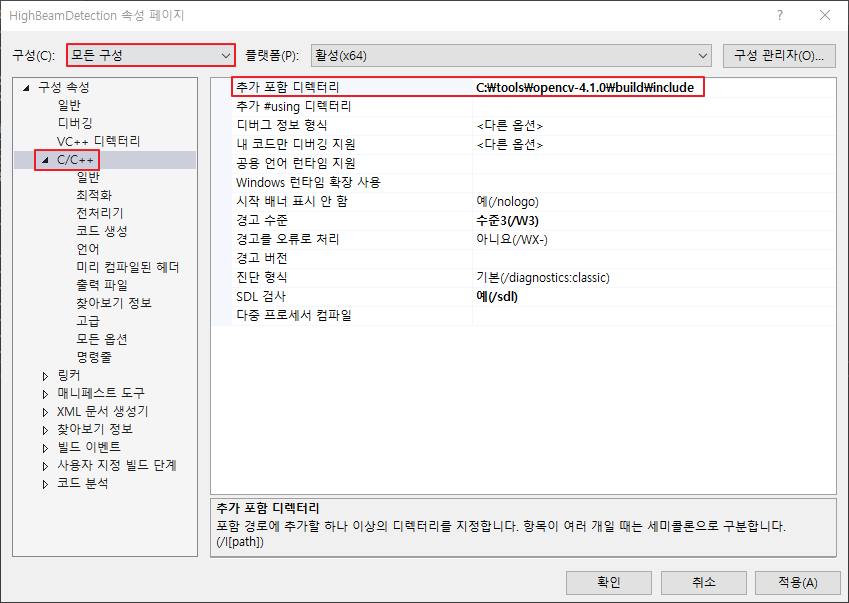
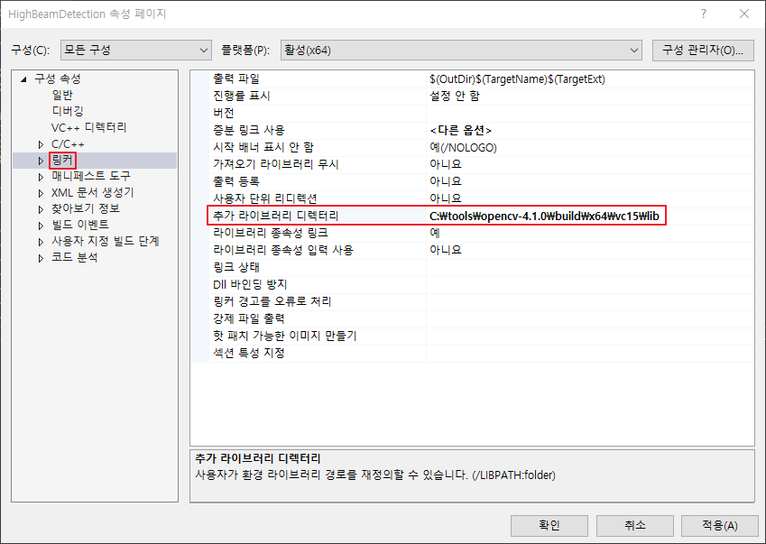
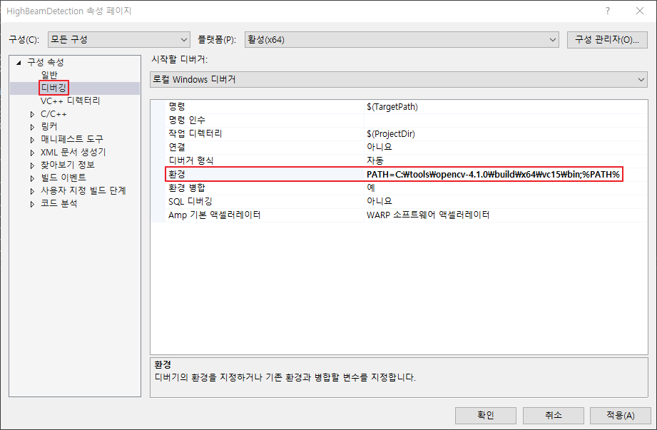
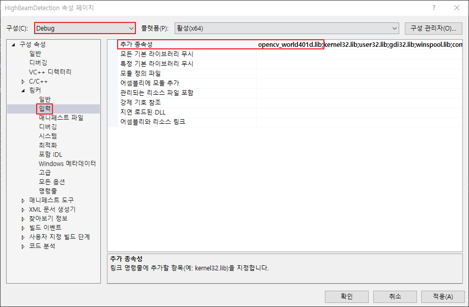
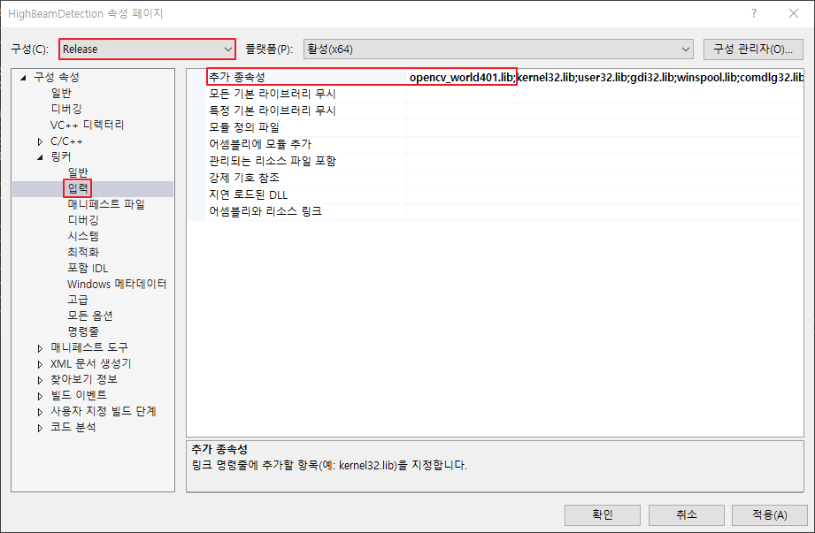

# OpenCV 4

Computer Vision library이다.

## C++

### Installation

다음의 link에서 download 받아 설치를 한다.

* [Download](https://opencv.org/releases)

임의의 위치에 설치를 할 수 있다. 다음의 위치에 설치를 했다고 가정을 한다.

> C:\tools\opencv-4.1.0

### Configuration

Visual Studio 2017에서 `Windows 데스크톱 마법사`를 선택하고 project를 생성한다.

Toolbar의 solution platform을 `x64`로 변경한다. (현재 x64 library만 배포되므로, x86을 사용할 경우 직접 build를 해서 사용해야 한다.)

다음의 screenshot을 참고하여 Project 속성을 설정한다.

