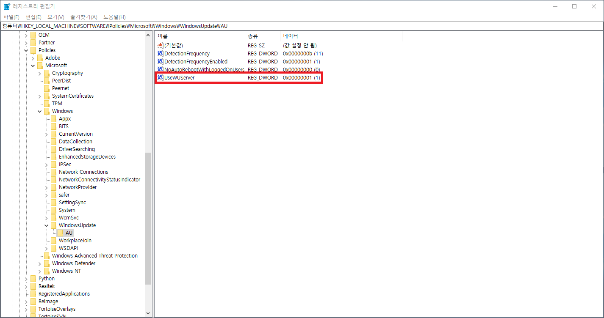

# Tips: Windows

## ToC

* [Slow Powershell](#Slow-Powershell)
* [Virtual Desktop](#Virtual-Desktop)
* [Action Center](#Action-Center)
* [WinX Menu](#WinX-Menu)
* [Record Movie](#Record-Movie)
* [Create Dummy File](#Create-Dummy-File)
* [Multiple Excel](#Multiple-Excel)
* [Install windows-build-tools with npm](#Install-windows-build-tools-with-npm)
* [Install .Net3.5 on Windows 10](#Install-.net3.5-on-Windows-10)

----

## [[Slow Powershell](https://github.com/PowerShell/PowerShell/issues/3080)]

> $ winrm quickconfig
>
> $ Measure-Command { Get-ComputerInfo }

## [Virtual Desktop]

* `<CTRL + WIN + d>` : Create
* `<CTRL + WIN + LEFT/RIGHT>` : Move focus
* `<CTRL + WIN + F4>` : Delete

## [Action Center]

* `<WIN + a>`

## [WinX Menu]

* `<WIN + x>`

## [Record Movie]

* `<WIN + g>`

## [Create Dummy File]

> $ fsutil file createnew \<name\> \<length\>

## [Multiple Excel]

1. Run `regedit` on `win+r`
2. Select `HKEY_CLASSES_ROOT/Excel.Sheet.12/shell/Open`
3. Delete `ddeexe/`, `command/command`
4. Update `(default value)`
5. Remove trailing `/dde` and append `/en "%1"` without whitespace
6. Repeat to `HKEY_CLASSES_ROOT/Excel.Sheet.8/shell/Open`

```
# Example
"C:\Program Files (x86)\Microsoft Office\Office14\EXCEL.EXE"/en "%1"
```

## [Install windows-build-tools with npm]

> $ npm install -g windows-build-tools

## [Install .net3.5 on Windows 10]

Windows 10 build 1809 version에서 .net3.5 기능을 설치하려면 다음의 순서를 따라서 한다.



1. 위 screenshot을 따라서 registry의 값을 **0**으로 설정한다.
2. `WIN+R`키를 눌러 실행을 실행시키고, `service.msc`를 입력한 후, `Windows Update` service를 재시작한다.
3. `제어판` -> `프로그램 및 기능` -> `Windows 기능 켜기/끄기`에서 `.NET Framework 3.5(.NET 2.0 및 3.0 포함)`을 체크하고 `확인`을 click한다.
4. 위 screenshot을 따라서 registry의 값을 **1**로 설정한다.
