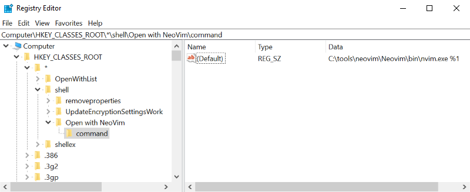
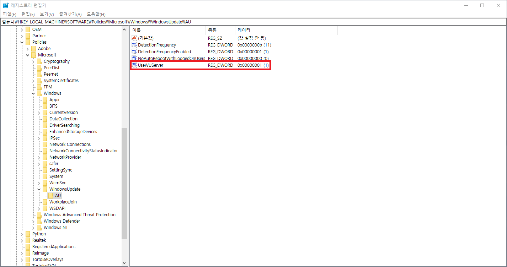

# Tips: Windows

## ToC

* [Paths](#Paths)
* [Slow Powershell](#Slow-Powershell)
* [Shortcuts](#Shortcuts)
* [Terminals](#Terminals)
* [Registries](#Registries)
* [Install windows-build-tools with npm](#Install-windows-build-tools-with-npm)
* [Install .Net3.5 on Windows 10](#Install-.net3.5-on-Windows-10)

----

## [Paths]

### Startup Folder

* All User

> C:\ProgramData\Microsoft\Windows\Start Menu\Programs\StartUp

* Current User

> C:\Users\Username\AppData\Roaming\Microsoft\Windows\Start Menu\Programs\Startup

## [[Slow Powershell](https://github.com/PowerShell/PowerShell/issues/3080)]

> $ winrm quickconfig
>
> $ Measure-Command { Get-ComputerInfo }

## [Shortcuts]

### Virtual Desktop

* `<CTRL + WIN + d>` : Create
* `<CTRL + WIN + LEFT/RIGHT>` : Move focus
* `<CTRL + WIN + F4>` : Delete

### Action Center

* `<WIN + a>`

### WinX Menu

* `<WIN + x>`

### Record Movie

* `<WIN + g>`

## [Terminals]

### Check as administrator

> $ ([Security.Principal.WindowsPrincipal] [Security.Principal.WindowsIdentity]::GetCurrent()).IsInRole([Security.Principal.WindowsBuiltInRole] "Administrator")

### Execute Policy

> $ Set-ExecutionPolicy RemoteSigned

* `Restricted` : Can't execute script. Default execute policy.
* `AllSigned` : 신뢰된 게시자의 digital 서명을 받은 script만 실행가능
* `RemoteSigned` : Internet에서 download하는 script 구성 file에는 digital 서명이 필요. Can execute local script.
* `Unstricted` : 서명되지 않은 script를 실행할 수 있다. Internet에서 download 받은 file에 대해서는 경고를 한다.
* `Bypass` : 모든 script나 구성 file을 실행할 수 있다.
* `Undefined` : 실행 정책이 설정되지 않았다.

### Create Dummy File

> $ fsutil file createnew \<name\> \<length\>

## [Registries]

### Multiple Excel

1. Run `regedit` on `win+r`
2. Select `HKEY_CLASSES_ROOT/Excel.Sheet.12/shell/Open`
3. Delete `ddeexe/`, `command/command`
4. Update `(default value)`
5. Remove trailing `/dde` and append `/en "%1"` without whitespace
6. Repeat to `HKEY_CLASSES_ROOT/Excel.Sheet.8/shell/Open`

```
# Example
"C:\Program Files (x86)\Microsoft Office\Office14\EXCEL.EXE"/en "%1"
```

### Add to Context Menu

1. Run `regedit` on `win+r`
2. Select `HKEY_CLASSED_ROOT/*/shell`
3. Create key with name in context menu
4. Create sub key `command`
5. Edit key data like below

    

## [Install windows-build-tools with npm]

> $ npm install -g windows-build-tools

## [Install .net3.5 on Windows 10]

Windows 10 build 1809 version에서 .net3.5 기능을 설치하려면 다음의 순서를 따라서 한다.



1. 위 screenshot을 따라서 registry의 값을 **0**으로 설정한다.
2. `WIN+R`키를 눌러 실행을 실행시키고, `service.msc`를 입력한 후, `Windows Update` service를 재시작한다.
3. `제어판` -> `프로그램 및 기능` -> `Windows 기능 켜기/끄기`에서 `.NET Framework 3.5(.NET 2.0 및 3.0 포함)`을 체크하고 `확인`을 click한다.
4. 위 screenshot을 따라서 registry의 값을 **1**로 설정한다.
